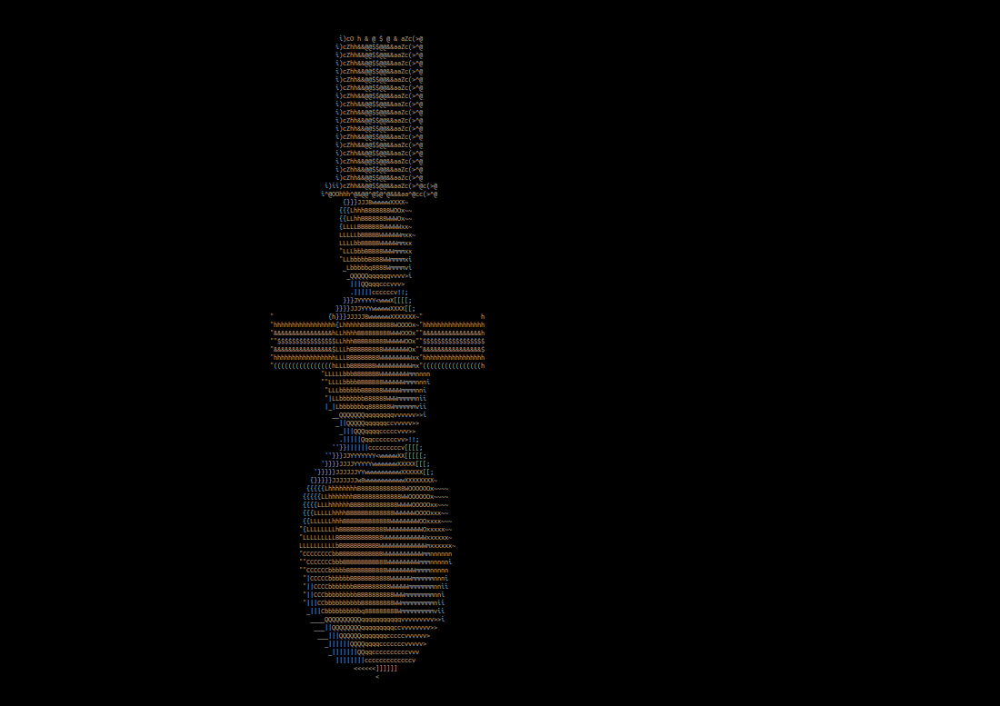

With his program you can view .obj files in the terminal.  
Version with ncurses: https://github.com/lukas-e-227/terminal_graphics (just works better)

## How to use  
1. call `make` inside the directory to compile with gcc

```code 
./ascii_graphics
./ascii_graphics assets/cow.obj
```
You probably have to resize your terminal to see everything.  
Stop execution with `Ctrl + C` :)

## Screenshot


## Problems 
No z-buffering or triangle sorting -> You can sometimes see triangles that should be hidden.  
Because i use a character array for storing the frames the program can segfault when it tries to draw to pixels outside of the borders. With the default resolution and provided models this does't happen though.
